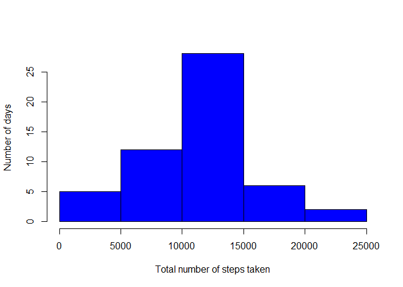
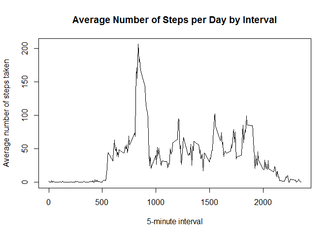
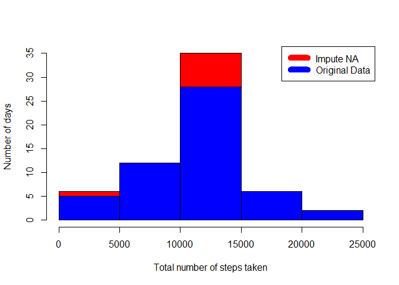
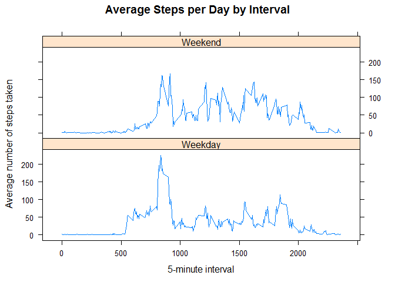

# Reproducible Research: Peer Assessment 1
Li Weixiong, Winston  
10 August 2015  
### Introduction
It is now possible to collect a large amount of data about personal movement using activity monitoring devices such as a Fitbit, Nike Fuelband, or Jawbone Up. These type of devices are part of the "quantified self" movement -- a group of enthusiasts who take measurements about themselves regularly to improve their health, to find patterns in their behavior, or because they are tech geeks. But these data remain under-utilized both because the raw data are hard to obtain and there is a lack of statistical methods and software for processing and interpreting the data.

This assignment makes use of data from a personal activity monitoring device. This device collects data at 5 minute intervals through out the day. The data consists of two months of data from an anonymous individual collected during the months of October and November, 2012 and include the number of steps taken in 5 minute intervals each day.


### Objective
The objective of this project is defined as follows:

1. Demostrate the ability to load and process data using R.
2. Interprete the data to answer the following questions:
    1. Loading and preprocessing the data.
    2. What is mean total number of steps taken per day?
    3. What is the average daily activity pattern?
    4. Imputing missing values.
    5. Are there differences in activity patterns between weekdays and weekends?
3. Demostrate the ability to use knitr to generate a readable document.


### Data
The data for this assignment was downloaded from the course website:

* Dataset: [Activity monitoring data](https://d396qusza40orc.cloudfront.net/repdata%2Fdata%2Factivity.zip) [52K]

The variables included in this dataset are:

* **steps**: Number of steps taking in a 5-minute interval (missing values are coded as `NA`)

* **date**: The date on which the measurement was taken in YYYY-MM-DD format

* **interval**: Identifier for the 5-minute interval in which measurement was taken

The dataset is stored in a comma-separated-value (CSV) file and there are a total of 17,568 observations in this dataset.


### 1. Loading and preprocessing the data
The following code will download (if it does not exist in the working directory) and extract the raw dataset file.

```r
if(!file.exists("activity.csv")) 
{
        temp <- tempfile()
        download.file("http://d396qusza40orc.cloudfront.net/repdata%2Fdata%2Factivity.zip", temp)
        data_filename <- unzip(temp)
        unlink(temp)
}else
{
        data_filename <- "activity.csv"
}
```

#### 1.1 Load the data (i.e. `read.csv()`)
Once the file has been extracted, the dataset is read into R as a data frame `data` with *stringsAsFactors = FALSE* and *na.strings = "NA"*

```r
data <- read.csv(data_filename, stringsAsFactors = FALSE, na.strings = "NA")
```


#### 1.2 Process/transform the data (if necessary) into a format suitable for your analysis
We will inspect the data frame `data` to see what class are the variables.

```r
str(data)
```

```
## 'data.frame':	17568 obs. of  3 variables:
##  $ steps   : int  NA NA NA NA NA NA NA NA NA NA ...
##  $ date    : chr  "2012-10-01" "2012-10-01" "2012-10-01" "2012-10-01" ...
##  $ interval: int  0 5 10 15 20 25 30 35 40 45 ...
```
Fom the above summary, we need to convert the date if from `Character` to `Date` for ease of manipulation later.

```r
data$date <- as.Date(data$date, "%Y-%m-%d")
str(data)
```

```
## 'data.frame':	17568 obs. of  3 variables:
##  $ steps   : int  NA NA NA NA NA NA NA NA NA NA ...
##  $ date    : Date, format: "2012-10-01" "2012-10-01" ...
##  $ interval: int  0 5 10 15 20 25 30 35 40 45 ...
```
### 2. What is mean total number of steps taken per day?
For this part of the assignment, we will ignore the missing values in the dataset.

#### 2.1. Calculate the total number of steps taken per day.
To calculate the total amount of steps taken per day, we will aggregate the dataset by sum of the steps taken by date.

```r
agg_steps_day <- aggregate(steps ~ date, data, sum)
head(agg_steps_day)
```

```
##         date steps
## 1 2012-10-02   126
## 2 2012-10-03 11352
## 3 2012-10-04 12116
## 4 2012-10-05 13294
## 5 2012-10-06 15420
## 6 2012-10-07 11015
```


#### 2.2. Make a histogram of the total number of steps taken each day.
The histogram below shows the Numbers of days (frequency) against Total number of steps taken.

```r
hist(agg_steps_day$steps, main = cat("Total number of steps taken per day"), col = "blue", ylab = "Number of days", xlab = "Total number of steps taken")
```

 

```
## Total number of steps taken per day
```


#### 2.3. Calculate and report the mean and median of the total number of steps taken per day.

```r
agg_steps_day_mean <- mean(agg_steps_day$steps)
agg_steps_day_median <- median(agg_steps_day$steps)
cat("Mean: ", agg_steps_day_mean, ", Median: ", agg_steps_day_median)
```

```
## Mean:  10766.19 , Median:  10765
```
The mean and median of the total number of steps taken per day is `1.0766189\times 10^{4}` and `10765` respectively.


### 3. What is the average daily activity pattern?
To achieve this requirement, we will aggregate the mean number of steps taken, averaged across all days.

```r
agg_steps_interval <- aggregate(steps ~ interval, data, mean)
head(agg_steps_interval)
```

```
##   interval     steps
## 1        0 1.7169811
## 2        5 0.3396226
## 3       10 0.1320755
## 4       15 0.1509434
## 5       20 0.0754717
## 6       25 2.0943396
```


#### 3.1. Make a time series plot (i.e. `type = "l"`) of the 5-minute interval (x-axis) and the average number of steps taken, averaged across all days (y-axis)

```r
plot(agg_steps_interval$interval,agg_steps_interval$steps, type = "l", xlab = "5-minute interval", ylab = "Average number of steps taken",main="Average Number of Steps per Day by Interval")
```

 


#### 3.2. Which 5-minute interval, on average across all the days in the dataset, contains the maximum number of steps?

```r
index_max_num_steps <- which.max(agg_steps_interval$steps)
cat("Interval: ", agg_steps_interval[index_max_num_steps, 1], ", Number of steps: ", agg_steps_interval[index_max_num_steps, 2])
```

```
## Interval:  835 , Number of steps:  206.1698
```
Interval `835` contains the maximum number of steps of `206.1698113`.


### 4. Impute missing values. Compare imputed to non-imputed data.
The presence of missing days may introduce bias into some calculations or summaries of the data.  Here we show what effect does this missing data have on our analysis.

#### 4.1. Calculate and report the total number of missing values in the dataset (i.e. the total number of rows with NAs)

```r
cat("Incomplete data rows: ", sum(!complete.cases(data)), ", Total number of data row: ", nrow(data))
```

```
## Incomplete data rows:  2304 , Total number of data row:  17568
```
In this dataset, there exist `2304` out of `17568` rows of data that is incomplete.

#### 4.2. Devise a strategy for filling in all of the missing values in the dataset. The strategy does not need to be sophisticated. For example, you could use the mean/median for that day, or the mean for that 5-minute interval, etc.
Here, we will adopt the following strategy for filling in all the missing values (`NA`):  
1. We will impute missing steps (`NA`) by the ceiling of mean of steps for the interval.
2. We assume that 2012-10-02 is the first day of use based on the rising thrend of the steps.  Thus 2012-10-01's `NA` will be set to 0 instead.

#### 4.3. Create a new dataset that is equal to the original dataset but with the missing data filled in.

```r
imputed_data <- transform(data, steps = ceiling(ifelse(is.na(data$steps), agg_steps_interval$steps[match(data$interval, agg_steps_interval$interval)], data$steps)))
imputed_data[imputed_data$date == "2012-10-01", 1] <- 0
```

#### 4.4. Make a histogram of the total number of steps taken each day and Calculate and report the mean and median total number of steps taken per day. Do these values differ from the estimates from the first part of the assignment? What is the impact of imputing missing data on the estimates of the total daily number of steps?

##### 4.4.1 Histogram of the total number of steps taken each day

```r
agg_steps_day_imputed <- aggregate(steps ~ date, imputed_data, sum)
head(agg_steps_day_imputed)
```

```
##         date steps
## 1 2012-10-01     0
## 2 2012-10-02   126
## 3 2012-10-03 11352
## 4 2012-10-04 12116
## 5 2012-10-05 13294
## 6 2012-10-06 15420
```

```r
hist(agg_steps_day_imputed$steps, main = cat("Total number of steps taken per day"), col="red", ylab = "Number of days", xlab = "Total number of steps taken")
```

```
## Total number of steps taken per day
```

```r
hist(agg_steps_day$steps, main = cat("Total number of steps taken per day"), col="blue", ylab = "Number of days", xlab = "Total number of steps taken", add = T)
legend("topright", c("Impute NA", "Original Data"), col=c("red", "blue"), lwd=10)
```

 


##### 4.4.2 Calculate and report the mean and median total number of steps taken per day.

```r
new_agg_steps_day_mean <- mean(agg_steps_day_imputed$steps)
new_agg_steps_day_median <- median(agg_steps_day_imputed$steps)
cat("Mean: ", new_agg_steps_day_mean, ", Median: ", new_agg_steps_day_median)
```

```
## Mean:  10606.08 , Median:  10909
```
The new mean and median of the total number of steps taken per day based on the imputed dataset is `1.0606082\times 10^{4}` and `1.0909\times 10^{4}` respectively.


##### 4.4.3 Do these values differ from the estimates from the first part of the assignment?

```r
mean_difference <- new_agg_steps_day_mean - agg_steps_day_mean
median_difference <- new_agg_steps_day_median - agg_steps_day_median
cat("Mean Difference: ", mean_difference, ", Median Difference: ", median_difference)
```

```
## Mean Difference:  -160.1067 , Median Difference:  144
```
The the difference for mean and median is `-160.106712` and `144` respectively.  From this, we can conclude that there is indeed difference between the imputed and the original mean and median.  


##### 4.4.4 What is the impact of imputing missing data on the estimates of the total daily number of steps?

```r
total_steps_day_difference <- sum(agg_steps_day_imputed$steps) - sum(agg_steps_day$steps)
cat("Total number of steps taken per day: ", total_steps_day_difference)
```

```
## Total number of steps taken per day:  76363
```
By impute of `NA` in the original dataset, there is in total `7.6363\times 10^{4}` added to the original dataset.


### 5. Are there differences in activity patterns between weekdays and weekends?

#### 5.1 Create a new factor variable in the dataset with two levels -- "weekday" and "weekend" indicating whether a given date is a weekday or weekend day.

```r
weekday_list <- c("Monday", "Tuesday", "Wednesday", "Thursday", "Friday")
imputed_data$day = as.factor(ifelse(is.element(weekdays(imputed_data$date),weekday_list), "Weekday", "Weekend"))
new_agg_steps_interval <- aggregate(steps ~ interval + day, imputed_data, mean)
head(new_agg_steps_interval)
```

```
##   interval     day     steps
## 1        0 Weekday 2.2444444
## 2        5 Weekday 0.5111111
## 3       10 Weekday 0.2666667
## 4       15 Weekday 0.2888889
## 5       20 Weekday 0.2000000
## 6       25 Weekday 1.6444444
```


#### 5.2  Make a panel plot containing a time series plot (i.e. `type = "l"`) of the 5-minute interval (x-axis) and the average number of steps taken, averaged across all weekday days or weekend days (y-axis).

```r
library(lattice)
xyplot(new_agg_steps_interval$steps ~ new_agg_steps_interval$interval|new_agg_steps_interval$day, , type = "l", main="Average Steps per Day by Interval",xlab = "5-minute interval", ylab = "Average number of steps taken",layout = c(1,2))
```

 

Overall, based on the graph above, there seem to be more steps taken on weekend in comparison with week days.
